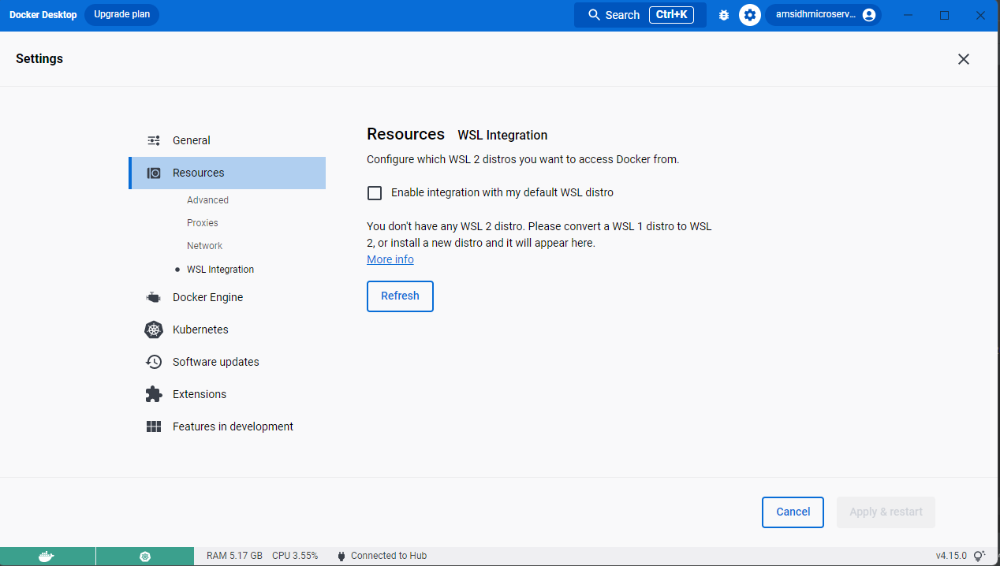

# MicroServices Project

# Get Kubernetes Resource version supported.
  kubectl api-resources

####
Change postgres to H2 database as it requires more effort to create database prior to deploy the service.
Removed zookeeper as gke itself discover service by service name.
Added ingress gateway to expose single public ip and route the rquest to specific service based on the rule configured

Following command wait for pod to become ready.
kubectl wait --namespace ingress-nginx --for=condition=ready pod --selector=app.kubernetes.io/component=controller --timeout=120s

https://kubernetes.github.io/ingress-nginx/deploy/#docker-for-mac

### For kubectl not able to pull images from know repository then please do the following steps:

1. Uncheck >Docker Desktop-> Resource-> WSL Integration
   

### Helm packaging using PGP security
helm package --sign --key amsidhlokhande@gmail.com --keyring C:\Users\amsid\AppData\Roaming\gnupg\secring.pgp helm\ms-account-service-chart -d helmcharts

helm show all oci://registry-1.docker.io/amsidhmicroservice/ms-card-service-chart --version 0.0.2-apm

### Prior to install helm chart of elastic and kibana of quickstart we have to install the crd using kubectl command
for elastic-kibana quickstart crds are located in [1-crds.yaml](deployment%2Fdevtool%2Fefk%2Felasticsearch-kibana%2F1-crds.yaml) 
and [2-operator.yaml](deployment%2Fdevtool%2Fefk%2Felasticsearch-kibana%2F2-operator.yaml)
OR
1) kubectl create -f https://download.elastic.co/downloads/eck/2.5.0/crds.yaml
2) kubectl apply -f https://download.elastic.co/downloads/eck/2.5.0/operator.yaml

Display secrets in plain text
kubectl get secret secret-basic-auth --template={{.data.users_roles}} | base64 --decode

kubectl get secret quickstart-kibana-user --template={{.stringData.users_roles}} | base64 --decode

kubectl get secret kibana-elasticsearch-credentials --template={{.elasticsearch.password}} | base64 --decode

quickstart-kibana-user
