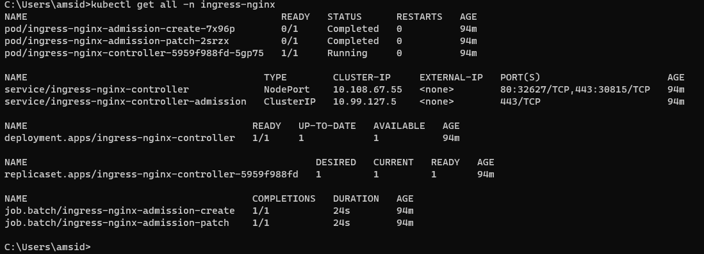

All below steps are for Windows local machine with minikube already installed

1) Create minikube cluster with below command
> minikube start --cpus 4 --memory 4000mb

then

 enable to ingress addon like below
> minikube addons enable ingress

After sometime please check below status

Do the port forwarding for the ingress controller.

> kubectl port-forward service/ingress-nginx-controller -n ingress-nginx 80:80

After that deploy your ingress-dateway.yaml file and check the address of your gateway
> kubectl apply -f ingress-gateway.yaml

Now go to the Windows/System32/drivers/etc/ path and open the hosts file with administrator 
privileges.
Add the entry like bleow
127.0.0.1 spring.microservice.com    
Here 127.0.0.1 is your local machine ip address.

Now hit the http://spring.microservice.com  url you will landing your application default page

