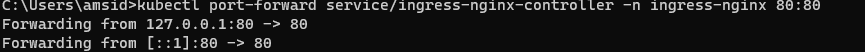
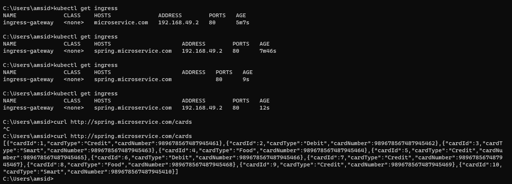
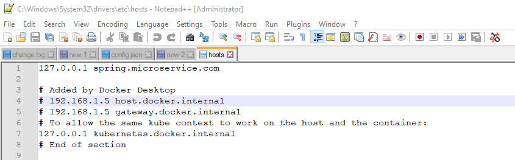
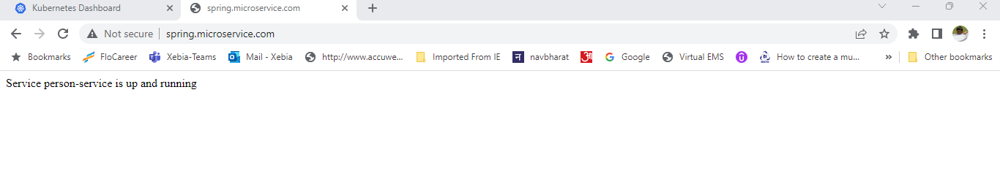
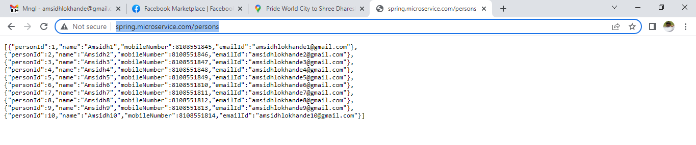

#### Ingress Gateway Setup on minikube or Docker-Desktop-Kubernetes
Blow steps for minikube
1) Create minikube cluster with below command
> minikube start --cpus 4 --memory 4000mb

2) 
     enable to ingress addon like below
    > minikube addons enable ingress
    
  OR

Below step is common for Minikube/Docker-Desktop-Kubernetes(after enabling kubernetes in docker desktop)   
> kubectl apply -f .\1-ingress-controller.yaml
 
3) After sometime please check below status
  >  kubectl get all -n ingress-nginx

5) Do the port forwarding for the ingress controller.
> kubectl port-forward service/ingress-nginx-controller -n ingress-nginx 80:80
   
 
6) After that deploy your 2-ingress-dateway.yaml file and check the address of your gateway

   > kubectl apply -f 2-ingress-gateway.yaml
     

Now go to the Windows/System32/drivers/etc/ path and open the hosts file with administrator 
privileges.
Add the entry like bleow
127.0.0.1 spring.microservice.com    
Here 127.0.0.1 is your local machine ip address.

Now hit the http://spring.microservice.com  url you will landing your application default page

